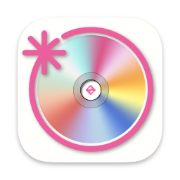
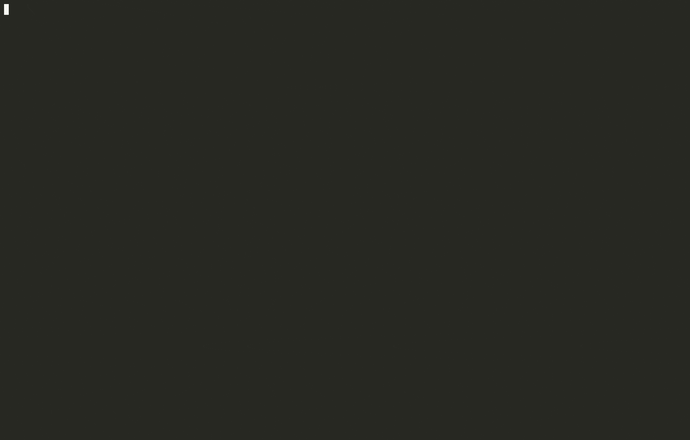

# IZ*ONE Mail Shelter

IZ*ONE Mail Shelter (IZMS)는 아이즈원 프라이빗 메일 앱에서 받은 메일들을 HTML 형식으로 로컬에 다운로드하는 파이썬 프로그램입니다.

첫 실행 후에는 로컬에 설정한 백업 디렉토리와 서버 메일함과의 차이를 비교하여 새로운 메일만 추가적으로 다운로드합니다.
본 리포는 아이즈원 프라이빗 메일 클라이언트 라이브러리 `IZONEMail` 클래스와 그것을 이용한 백업 스크립트 `izms.py`로 구성되어 있습니다.

## Changelog

**2021.03.22**
- 한국어 README 추가
- 설정 파일 이름 변경 `user_settings.json` → `config.json`
- 메일 다운로드 순서 변경 (제일 오래된 메일부터)
- Customizable 메일 저장 경로
- Standalone bundle 제공
- CSS, 사진 별도 저장 옵션
- 백업 디렉토리를 스캔하지 않고 별도의 INDEX를 통해 다운로드한 메일 관리
- Verbose error logs

## 시작하기

IZMS는 다음 환경에서 테스트 되었습니다.
- Python 3.7~
- macOS 10.15~
- Windows 10
- Ubuntu 20.04 64-bit

### 방법1: Standalone 패키지

미리 빌드된 실행 파일을 이용하여 파이썬이나 기타 종속성을 설치하지 않고 IZMS를 사용할 수 있습니다.

#### 1. IZMS 실행파일 다운로드 및 압축 풀기 

[IZMS 릴리즈 페이지](https://github.com/coloriz/izone-mail-shelter/releases) 에서 자신의 운영체제에 맞는 버전을 다운받고 압축을 풉니다.
> ⚠️ 다운받을 때 브라우저에 따라 경고창이 뜨며 다운로드되지 않을 수 있습니다.
> 이것은 IZMS 실행파일이 인증서로 서명되지 않았기 때문이며, '계속'을 눌러 다운로드 받을 수 있습니다.
> 서명되지 않은 실행파일은 일부 백신 프로그램에서 바이러스로 인식할 수도 있습니다. 이 경우 백신에서 예외 등록을 하거나 방법2로 시도하시기 바랍니다.

#### 2. config.json 설정

```json5
{
  // ...
  "profile": {
    "user-id": "유저 ID",
    "access-token": "액세스 토큰",
    // ...
  }
}
```
실행을 위해서는 먼저 설정 파일 `config.json`을 수정해야 합니다.
Charles, Wireshark, Burp Suite등의 SSL 패킷 캡처 툴을 이용하여 알아낸 자신의 `user-id`와 `access-token`을 `config.json`에 입력합니다.

아래는 `user-id`, `access-token`을 입력한 완전한 `config.json`의 예시입니다.

**Example config.json**
```json
{
  "mail_path": "incoming/{member_id}/{mail_id}.html",
  "embed_css": false,
  "css_path": "../css",
  "image_to_base64": false,
  "image_path": "img",
  "profile": {
    "user-id": "57crzfhy4is0",
    "access-token": "klcr55c7000k82f1603oa6al",
    "os-type": "iOS",
    "terms-version": "5",
    "application-version": "1.2.3",
    "application-language": "ko"
  }
}
```

#### 3. 실행

터미널을 열고 압축을 푼 경로로 이동합니다. 윈도우의 경우 터미널은 powershell을 추천합니다.
```shell
> cd "IZMS 경로"
```

앱을 실행합니다.
```shell
> ./izms
```


만약 `user-id`나 `access-token`을 잘못 입력했을 경우 401 Unauthorized 에러가 출력됩니다.

#### 4. 다운로드 받은 메일 확인하기

기본값을 바꾸지 않으면 메일은 `incoming/` 폴더에 저장됩니다.


### 방법2: 소스에서 직접 실행

#### 1. Clone repo
```shell
> git clone https://github.com/coloriz/izone-mail-shelter.git
> cd izone-mail-shelter
```

#### 2. Install dependencies
```shell
> pip install -r requirements.txt
```

#### 3. config.json 설정

방법1 참조.

#### 4. 실행

```shell
> python izms.py
```


## 설정 가이드

IZMS 실행을 위해선 `config.json` 파일이 실행파일과 같은 위치에 있어야 합니다.
`config.json` 파일 수정을 통해 메일 저장 경로, HTML에 이미지 포함 여부 등을 커스터마이징 할 수 있습니다.
설명을 위해 아래 메일을 예시로 사용하겠습니다.

```text
메일ID : m21937
멤버이름 : 미야와키 사쿠라
멤버ID : 2
수신일시 : 2021/03/22 10:46
제목 : 🥺💗🌸
```

### 메일 저장 경로

다음은 `mail_path`값을 변경하여 메일 저장 경로를 커스터마이징하는 몇 가지 예시를 보여줍니다.

**멤버ID로 폴더 분류, 메일ID로 저장 (기본값)**
```json5
{
  "mail_path": "incoming/{member_id}/{mail_id}.html"
}
// 메일 저장 경로 : incoming/2/m21937.html
```

**멤버ID가 아닌 멤버이름 폴더에 저장**
```json5
{
  "mail_path": "incoming/{member_name}/{mail_id}.html"
}
// 메일 저장 경로 : incoming/미야와키 사쿠라/m21937.html
```

**메일 수신일과 제목을 파일명으로 사용하기**
```json5
{
  "mail_path": "incoming/{member_name}/{received:%Y%m%d}_{subject}.html"
}
// 메일 저장 경로 : incoming/미야와키 사쿠라/20210322_🥺💗🌸.html
```
> 메일 제목에 이모지가 포함되어 있는 경우가 많습니다. 경우에 따라 운영체제는 이모지가 들어간 파일명을 제대로 핸들링하지 못 할 수 있으니
> 메일 제목을 파일명으로 사용하는 것은 그다지 추천하지 않습니다.

**메일을 멤버 단위가 아닌 수신일로 분류하기**
```json5
{
  "mail_path": "incoming/{received:%Y%m%d}/{mail_id}.html"
}
// 메일 저장 경로 : incoming/20210322/m21937.html
```

### 이미지, CSS 임베딩 여부

**이미지와 CSS를 별도 경로에 저장 (기본값)**
```json5
{
  "embed_css": false,
  "css_path": "../css",
  "image_to_base64": false,
  "image_path": "img"
}
// 메일이 incoming/2/m21937.html에 저장될 때,
// CSS 저장 경로 : incoming/css/
// 이미지 저장 경로 : incoming/2/img/
```

**이미지와 CSS를 HTML 안에 포함시키기**
```json5
{
  "embed_css": true,
  "image_to_base64": true,
  // css_path, image_path는 무시됩니다.
}
```
이 경우 모든 정보가 HTML 파일 안에 포함되므로 나중에 HTML 파일 위치를 바꿔도 레이아웃이나 이미지가 깨지지 않는 장점이 있습니다.


## Appendix

### `INDEX`, `HEAD` 파일에 대해
첫 실행시 생성되는 메타데이터 파일로써 로컬에 다운로드한 메일 정보를 담고 있습니다.
만약 설정 파일 변경 등의 이유로 백업을 처음부터 다시 하고자 하는 경우 다운로드 폴더와 이 두 파일을 삭제하시기 바랍니다. 

### `config.json`
애플리케이션 설정 파일입니다. 실행파일과 같은 폴더에 위치해야합니다. 유효한 key는 다음과 같습니다.

#### `mail_path` (`str`, required)
메일 저장 경로 템플릿입니다. 다음과 같은 치환가능한 변수들이 있습니다.
- `{member_id}`: 멤버 ID (`str`)
- `{member_name}`: 멤버 이름 (`str`)
- `{mail_id}`: 메일 ID (`str`)
- `{received}`: 메일 수신일시 (`datetime`)
- `{subject}`: 메일 제목 (`str`)

#### `embed_css` (`bool`, default: False)
CSS를 메일 HTML에 포함시킵니다.

#### `css_path` (`str`, default: '../css')
`embed_css`가 `true`일 경우 CSS를 저장할 HTML 파일에 대한 상대경로입니다.

#### `image_to_base64` (`bool`, default: False)
메일의 이미지를 HTML에 base64로 인코딩하여 내장합니다.

#### `image_path` (`str`, default: 'img')
`image_to_base64`가 `true`일 경우 이미지를 저장할 HTML 파일에 대한 상대경로입니다.

#### `profile` (`object`, required)
REST API 요청에 사용되는 헤더를 정의합니다. key는 모두 소문자입니다.
  - `user-id`: 유저 ID
  - `access-token`: 액세스 토큰
  - `terms-version`: 약관 동의 버전 ("5")
  - `os-type`: 모바일 운영체제 타입 ["iOS", "android"]
  - `application-version`: 프메앱 버전 iOS: "1.2.3", android: "1.4.5" (작성일(2021.03.22) 기준)
  - `application-language`: 앱 언어 ["ko", "ja", "en"] (멤버 이름 언어를 바꿀 수 있음)


  - 기타 optional header: `device-version`, `os-version`
  - 기타 HTTP header: `user-agent`, `accept-encoding`, `accept`, `accept-encoding`, `accept-language`

#### `timeout` (`float`, default: 5)
HTTP 요청 timeout (초)

#### `max_retries` (`int`, default: 3)
HTTP 요청 실패시 최대 재시도 횟수

#### `finish_hook` (`str`)
프로그램 종료시 호출될 핸들러 경로 (args: "program name" "num of downloaded mails")
